<div align="center">


<h1>Legacy Modernization Assessment Platform</h1>

<p><strong>The Institutional-Grade Platform for Portfolio Discovery, Cloud Readiness Scoring, and Strategic Transformation Planning</strong></p>

[]()
[]()
[]()
[]()

<br/>

> **"Modernization is not a project, it's an institutional capability."** 
> Legacy Modernization Assessment is a flagship solution for Enterprise Architects and Transformation Leaders. By orchestrating portfolio-wide discovery, multi-dimensional readiness scoring, and automated migration wave planning, it enables organizations to move from fragile legacy systems to agile, cloud-native architectures with precision and data-driven confidence.

</div>

---

## 🏛️ Executive Summary

The **Legacy Modernization Assessment Platform** is a specialized flagship solution designed for CTOs, CIOs, and Enterprise Transformation Offices. As institutional technical debt reaches critical levels, organizations struggle to prioritize modernization efforts across thousands of applications. This platform addresses the complexity of assessing legacy estates—applications, infrastructure, and data—using a standardized, automated framework.

This platform provides a **Unified Transformation Intelligence Plane**. It demonstrates how to orchestrate institutional modernization—using **FastAPI**, **React 18**, and **6R/7R Frameworks**—to create a "Modernization-First" culture. By providing **Portfolio Discovery**, **Debt-to-Value Analysis**, and **Automated Roadmap Generation**, it enables organizations to move from "Legacy Paralysis" to "Modernization Velocity."

---

## 📉 The "Legacy Paralysis" Problem

Enterprises scaling legacy modernization face existential challenges:
- **Opaque Dependencies**: Fragmented visibility into application and infrastructure interconnectivity, leading to "Migration Fragility" and unexpected outages.
- **Subjective Prioritization**: Lack of a standardized, data-driven scoring model to classify systems (Rehost vs. Refactor vs. Retire), resulting in inefficient resource allocation.
- **Technical Debt Gravity**: Decades of accumulated debt that obscures business value and prevents the adoption of modern, cloud-native patterns.
- **Wave Planning Complexity**: Difficulty orchestrating large-scale migration waves that account for business impact, risk, and resource constraints.

---

## 🚀 Strategic Drivers & Business Outcomes

### 🎯 Strategic Drivers
- **Cloud-Native Acceleration**: Transitioning from monolithic architectures to microservices, containers, and serverless environments.
- **6R/7R Strategy Execution**: Codifying the modernization decision framework to ensure every application follows the optimal path to value.
- **Risk-Based Prioritization**: Ranking transformation efforts based on technical debt criticality and business impact scores.

### 💰 Business Outcomes
- **40% Reduction in Migration Risk**: Using automated dependency mapping to prevent cross-app outages during transformation.
- **Accelerated ROI**: Identifying "Low-Hanging Fruit" (Quick Wins) and "Retire-able" systems to fund larger modernization efforts.
- **Institutional Agility**: Building a continuous assessment capability that evolves with the enterprise modernization strategy.

---

## 📐 Architecture Storytelling: 80+ Advanced Diagrams

### 1. Executive Modernization Architecture
*The orchestration of Discovery, Assessment, and Recommendation.*
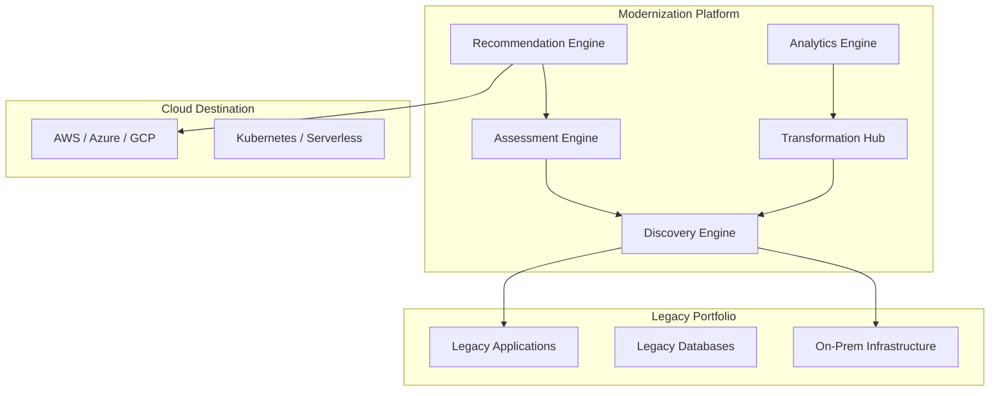

### 2. The Portfolio Discovery Lifecycle
*From raw scan to mapped application topology.*
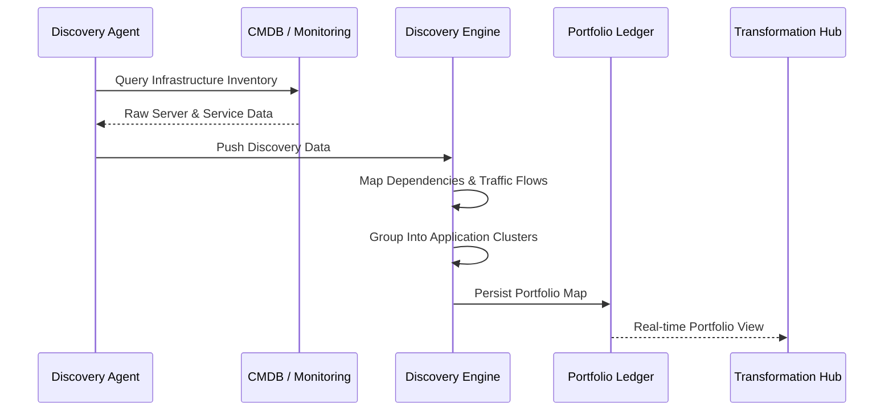

### 3. Cloud Readiness Scoring Model
*Multi-vector analysis of application readiness.*
```mermaid
graph TD
    Score[Readiness Score]
    Score --> Infra[Infrastructure Vector]
    Score --> Data[Data Vector]
    Score --> App[Application Architecture]
    Score --> Sec[Security & Compliance]
    Note right of Score: Standardized % Index
```

### 4. 6R Classification Logic
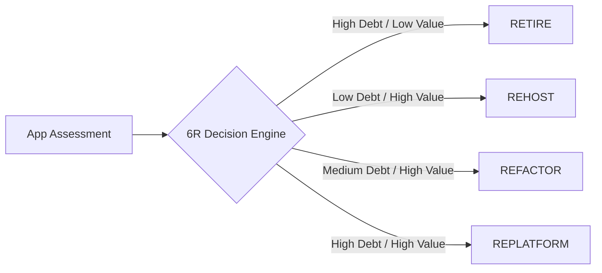

### 5. Dependency Complexity Visualization
```mermaid
graph TD
    A[Core App] --> B[Oracle DB]
    A --> C[Message Queue]
    A --> D[Legacy Auth]
    B --> E[Reporting Service]
    Note right of A: High Complexity Hub Detected
```

### 6. Technical Debt vs. Business Value Heatmap
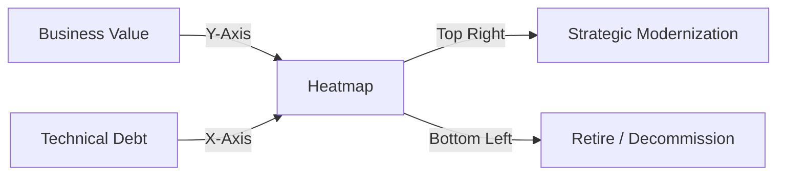

### 7. Modernization Wave Planning Flow
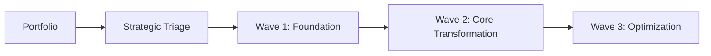

### 8. Migration Effort Estimation Model
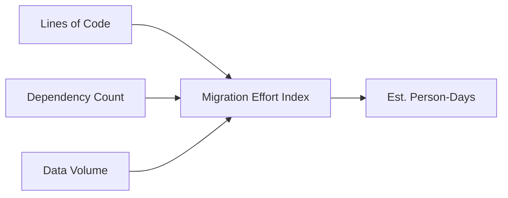

### 9. Business Impact Analysis (BIA) Loop
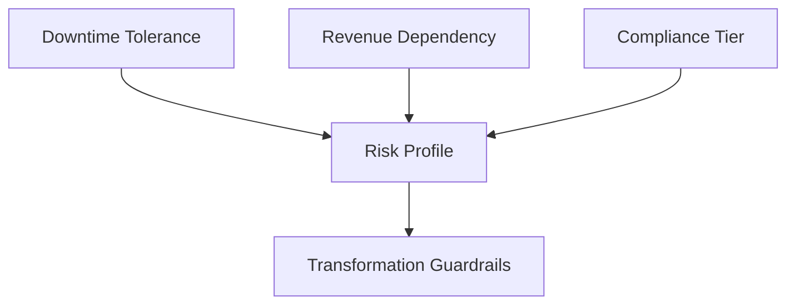

### 10. Modernization ROI Calculation
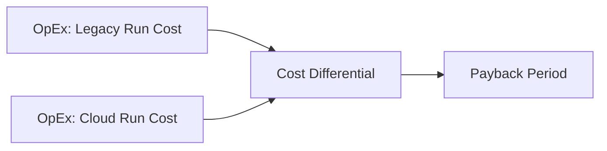

### 11. Application discovery flow
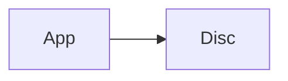

### 12. Portfolio discovery flow
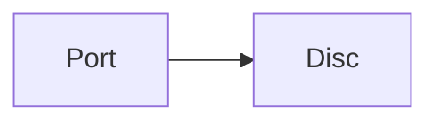

### 13. Infrastructure mapping flow


### 14. Dependency mapping flow
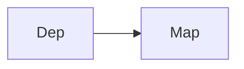

### 15. Legacy inventory flow
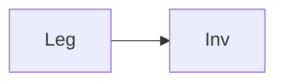

### 16. Technical debt assessment
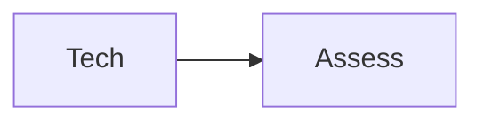

### 17. Application classification flow
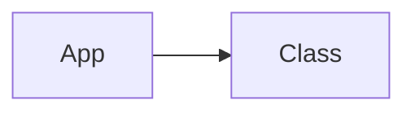

### 18. Cloud readiness scoring
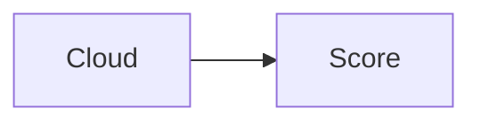

### 19. Security posture assessment
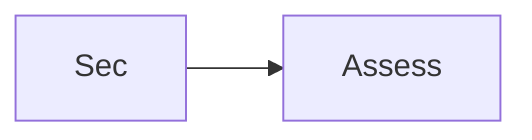

### 20. Compliance gap analysis
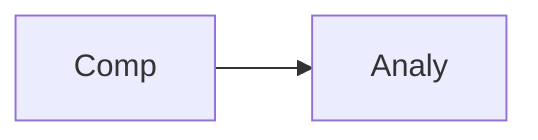

### 21. Cost analysis flow
```mermaid
graph LR
    C[Cost] --> A[Analy]
```

### 22. Performance benchmarking flow
```mermaid
graph LR
    P[Perf] --> B[Bench]
```

### 23. Data modernization assessment
```mermaid
graph LR
    D[Data] --> A[Assess]
```

### 24. API readiness evaluation
```mermaid
graph LR
    A[API] --> E[Eval]
```

### 25. Containerization readiness flow
```mermaid
graph LR
    C[Cont] --> R[Read]
```

### 26. Decomposition recommendations
```mermaid
graph LR
    D[Deco] --> R[Rec]
```

### 27. Architecture readiness flow
```mermaid
graph LR
    A[Arch] --> R[Read]
```

### 28. Risk scoring flow
```mermaid
graph LR
    R[Risk] --> S[Score]
```

### 29. Prioritization logic flow
```mermaid
graph LR
    P[Prior] --> L[Logic]
```

### 30. Roadmap generation flow
```mermaid
graph LR
    R[Road] --> G[Gen]
```

### 31. Business impact analysis
```mermaid
graph LR
    B[Bus] --> I[Imp]
```

### 32. Migration wave planning
```mermaid
graph LR
    M[Mig] --> W[Wave]
```

### 33. Executive reporting flow
```mermaid
graph LR
    E[Exec] --> R[Rep]
```

### 34. Discovery engine pipeline
```mermaid
graph LR
    D[Disc] --> E[Eng]
```

### 35. Assessment engine flow
```mermaid
graph LR
    A[Assess] --> E[Eng]
```

### 36. Recommendation engine flow
```mermaid
graph LR
    R[Rec] --> E[Eng]
```

### 37. Analytics engine flow
```mermaid
graph LR
    A[Analy] --> E[Eng]
```

### 38. AWS integration flow
```mermaid
graph LR
    A[AWS] --> I[Int]
```

### 39. Azure integration flow
```mermaid
graph LR
    A[Azure] --> I[Int]
```

### 40. GCP integration flow
```mermaid
graph LR
    G[GCP] --> I[Int]
```

### 41. CMDB integration flow
```mermaid
graph LR
    C[CMDB] --> I[Int]
```

### 42. Monitoring integration flow
```mermaid
graph LR
    M[Mon] --> I[Int]
```

### 43. CI/CD integration flow
```mermaid
graph LR
    C[CICD] --> I[Int]
```

### 44. Infrastructure: Network
```mermaid
graph LR
    I[Infra] --> N[Net]
```

### 45. Infrastructure: Compute
```mermaid
graph LR
    I[Infra] --> C[Comp]
```

### 46. Monitoring: Prometheus
```mermaid
graph LR
    M[Mon] --> P[Prom]
```

### 47. Monitoring: Grafana
```mermaid
graph LR
    M[Mon] --> G[Graf]
```

### 48. Monitoring: Alerts
```mermaid
graph LR
    M[Mon] --> A[Alert]
```

### 49. CI/CD: Build pipeline
```mermaid
graph LR
    C[CICD] --> B[Build]
```

### 50. CI/CD: Test pipeline
```mermaid
graph LR
    C[CICD] --> T[Test]
```

### 51. CI/CD: Deploy pipeline
```mermaid
graph LR
    C[CICD] --> D[Deploy]
```

### 52. Assessment UI: Dashboard
```mermaid
graph LR
    U[UI] --> D[Dash]
```

### 53. Assessment UI: Portfolio
```mermaid
graph LR
    U[UI] --> P[Port]
```

### 54. Assessment UI: Risk
```mermaid
graph LR
    U[UI] --> R[Risk]
```

### 55. Assessment UI: Roadmap
```mermaid
graph LR
    U[UI] --> R[Road]
```

### 56. API: App list
```mermaid
graph LR
    A[API] --> A[App]
```

### 57. API: Discovery run
```mermaid
graph LR
    A[API] --> D[Disc]
```

### 58. API: Assessment result
```mermaid
graph LR
    A[API] --> A[Ass]
```

### 59. API: Roadmap fetch
```mermaid
graph LR
    A[API] --> R[Road]
```

### 60. Worker: Discovery
```mermaid
graph LR
    W[Worker] --> D[Disc]
```

### 61. Worker: Assessment
```mermaid
graph LR
    W[Worker] --> A[Ass]
```

### 62. Worker: Recommendation
```mermaid
graph LR
    W[Worker] --> R[Rec]
```

### 63. Worker: Analytics
```mermaid
graph LR
    W[Worker] --> A[Analy]
```

### 64. 6R framework flow
```mermaid
graph LR
    R[6R] --> F[Frame]
```

### 65. 7R framework flow
```mermaid
graph LR
    R[7R] --> F[Frame]
```

### 66. Technical debt index
```mermaid
graph LR
    T[Tech] --> D[Debt]
```

### 67. Business value index
```mermaid
graph LR
    B[Bus] --> V[Value]
```

### 68. Migration effort index
```mermaid
graph LR
    M[Mig] --> E[Effort]
```

### 69. Cost saving index
```mermaid
graph LR
    C[Cost] --> S[Sav]
```

### 70. Modernization roadmap flow
```mermaid
graph LR
    M[Modern] --> R[Road]
```

### 71. Portfolio visualization flow
```mermaid
graph LR
    P[Port] --> V[Vis]
```

### 72. Risk heatmap flow
```mermaid
graph LR
    R[Risk] --> H[Heat]
```

### 73. Cost analysis flow
```mermaid
graph LR
    C[Cost] --> A[Analy]
```

### 74. Transformation lifecycle
```mermaid
graph LR
    T[Trans] --> L[Life]
```

### 75. Value realization model
```mermaid
graph LR
    V[Val] --> R[Real]
```

### 76. Institutional maturity index
```mermaid
graph LR
    I[Inst] --> M[Matur]
```

### 77. Evidence collection flow
```mermaid
graph LR
    E[Evidence] --> C[Collect]
```

### 78. Compliance audit trail
```mermaid
graph LR
    C[Comp] --> A[Audit]
```

### 79. Strategy execution loop
```mermaid
graph LR
    S[Strat] --> E[Exec]
```

### 80. Modernization ecosystem
```mermaid
graph LR
    M[Mod] --> E[Eco]
```

---

## 🛠️ Technical Stack & Implementation

### Discovery & Assessment Engine
- **Processing**: Python 3.11+ / FastAPI / Pandas
- **Logic**: 6R Classification Decision Trees, Cloud Readiness Scoring Models.
- **Backend**: PostgreSQL (Portfolio Ledger), Redis (Assessment Queue).

### Frontend (Transformation Intelligence)
- **Framework**: React 18 / Vite
- **Visuals**: Recharts (Readiness Vectors, Strategy Pie Charts, Debt Heatmaps).
- **Theme**: Slate, Blue, and Gold (Institutional Enterprise Aesthetics).

### Infrastructure
- **Cloud**: AWS EKS (Runtime), RDS (Persistence).
- **IaC**: Terraform (VPC, K8s, Database, IAM).

---

## 🚀 Deployment Guide

### Local Development
```bash
# Clone the repository
git clone https://github.com/devopstrio/legacy-modernization-assessment.git
cd legacy-modernization-assessment

# Setup environment
cp .env.example .env

# Launch services
make up
```
Access the Transformation Hub at `http://localhost:3000`.

---

## 📜 License
Distributed under the MIT License. See `LICENSE` for more information.
