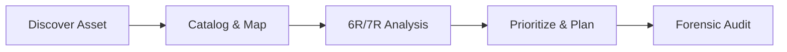
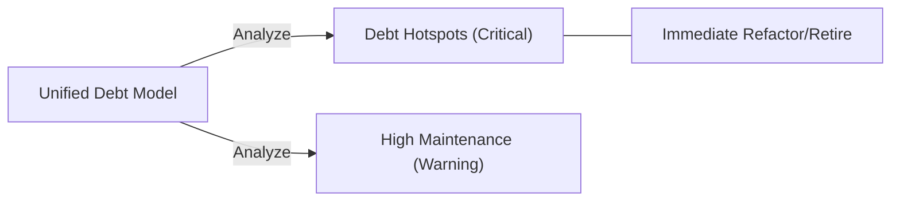
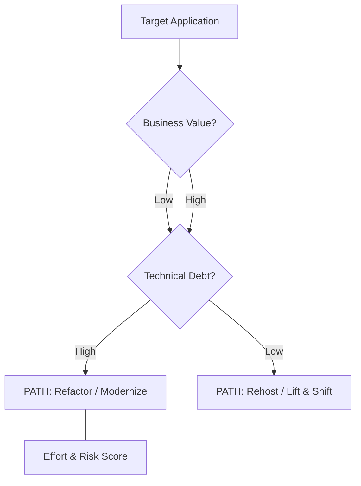
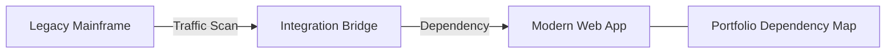
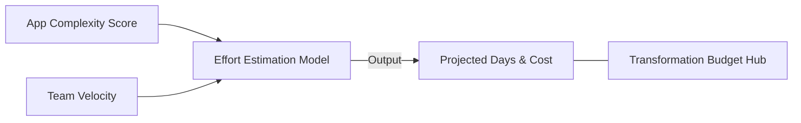
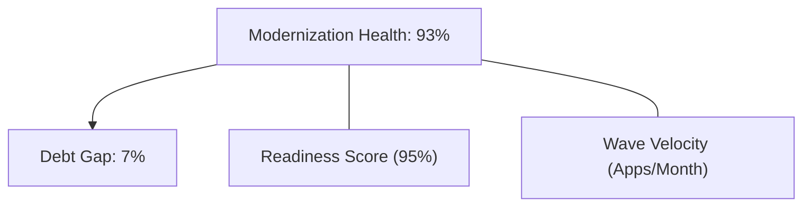
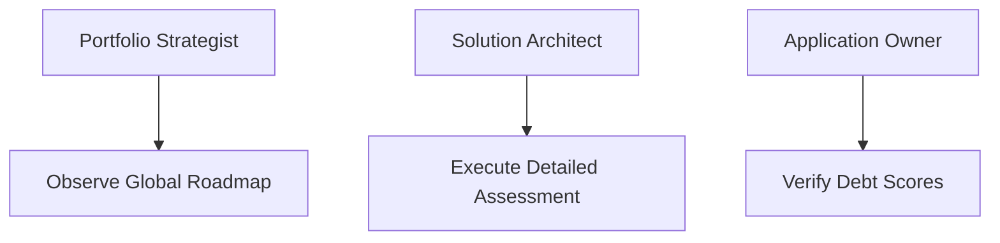
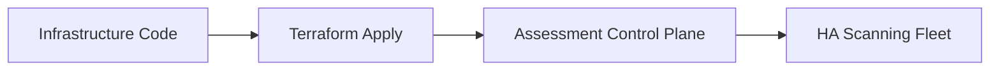
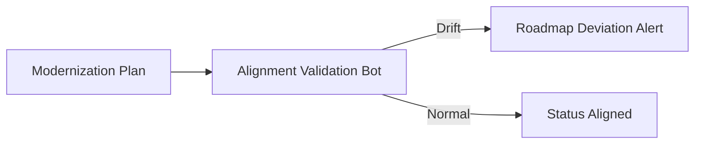
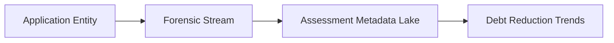

<div align="center">


<h1>Legacy Modernization Assessment</h1>

<p><strong>The Institutional-Grade Platform for Portfolio Discovery, Cloud Readiness Scoring, and Strategic Transformation Planning.</strong></p>

[]()
[]()
[]()

<br/>

> **"Modernization is not a project, it's an institutional capability."** 
> **Legacy Modernization Assessment** is an enterprise-grade platform designed to provide a secure, measurable, and highly automated foundation for global transformation operations. It orchestrates the complex lifecycle of legacy modernization—from portfolio-wide discovery and automated debt analysis to 6R/7R strategy selection and unified transformation governance.

</div>

---

## 🏛️ Executive Summary

Fragmented legacy portfolios and manual modernization assessments are strategic operational liabilities; lack of centralized transformation orchestration is a primary barrier to organizational cloud scaling. Organizations fail to achieve rapid modernization not because of a lack of talent, but because of fragmented assessment standards, lack of automated debt analysis, and an inability to orchestrate transformation waves with operational precision.

This platform provides the **Transformation Intelligence Plane**. It implements a complete **Enterprise Assessment-as-Code Framework**, enabling Portfolio and Engineering teams to manage global modernization efforts as first-class citizens. By automating the identification of technical debt hotspots and orchestrating real-time 6R/7R strategy selection, we ensure that every organizational asset—from legacy COBOL mainframes to monolithic Java applications—is assessed by default, audited for history, and strictly aligned with institutional modernization frameworks.

---

## 📐 Architecture Storytelling: Principal Reference Models

### 1. Principal Architecture: Global Legacy Modernization & Transformation Intelligence Plane
This diagram illustrates the end-to-end flow from multi-source discovery and debt analysis to 6R/7R strategy selection, risk-based wave planning, and institutional transformation auditing.


```mermaid
graph LR
    %% Subgraph Definitions
    subgraph PortfolioDiscovery["Multi-Source Discovery Ingress"]
        direction TB
        CMDBScan["CMDB & Inventory Scan"]
        TrafficAnalysis["Network Traffic Analysis"]
        CodeScan["Technical Debt Code Scan"]
    end

    subgraph IntelligenceEngine["Transformation Intelligence Hub"]
        direction TB
        API["FastAPI Assessment Gateway"]
        DebtAnalyzer["Technical Debt & Complexity Engine"]
        StrategyEngine["6R/7R Path Selection Engine"]
        WaveOrch["Migration Wave Orchestrator"]
    end

    subgraph AnalysisPlane["Distributed Analysis Fleet"]
        direction TB
        ScanningWorkers["Code & Infra Scan Workers"]
        DependencyMap["Dependency Graph Generator"]
        EffortEstimator["Risk & Effort Estimator"]
    end

    subgraph OperationsHub["Institutional Transformation Hub"]
        direction TB
        Scorecard["Modernization Maturity Score"]
        Analytics["Debt & Readiness Stats"]
        Audit["Forensic Assessment Metadata Lake"]
    end

    subgraph DevOps["Assessment-as-Code Orchestration"]
        direction TB
        TF["Terraform Assessment Modules"]
        RoadmapBot["Automated Roadmap Generator"]
        ChatOps["Strategy Approval Hub"]
    end

    %% Flow Arrows
    PortfolioDiscovery -->|1. Submit Discovery Data| API
    API -->|2. Analyze Debt| DebtAnalyzer
    DebtAnalyzer -->|3. Select Modernization Path| StrategyEngine
    StrategyEngine -->|4. Orchestrate Waves| WaveOrch
    
    WaveOrch -->|5. Execute Analysis| AnalysisPlane
    AnalysisPlane -->|6. Notify Roadmap| ChatOps
    API -->|7. Visualize Readiness| Scorecard
    
    Scorecard -->|8. Track Debt| Analytics
    Scorecard -->|9. Record Strategy| Audit
    
    TF -->|10. Provision Hub| IntelligenceEngine
    RoadmapBot -->|11. Inject Plan| WaveOrch
    Audit -->|12. Improve Scoring| StrategyEngine

    %% Styling
    classDef ingress fill:#f5f5f5,stroke:#616161,stroke-width:2px;
    classDef intel fill:#e3f2fd,stroke:#1565c0,stroke-width:2px;
    classDef analysis fill:#e1f5fe,stroke:#01579b,stroke-width:2px;
    classDef ops fill:#ede7f6,stroke:#311b92,stroke-width:2px;
    classDef devops fill:#fffde7,stroke:#f57f17,stroke-width:2px;

    class PortfolioDiscovery ingress;
    class IntelligenceEngine intel;
    class AnalysisPlane analysis;
    class OperationsHub ops;
    class DevOps devops;
```

### 2. The Modernization Assessment Lifecycle Flow
The continuous path of a legacy application from initial discovery and cataloging to active 6R/7R analysis, prioritization, planning, and institutional forensic auditing.


```mermaid
graph LR
    Discover["Discover Asset"] --> Catalog["Catalog & Map"]
    Catalog --> Analyze["6R/7R Analysis"]
    Analyze --> Plan["Prioritize & Plan"]
    Plan --> Audit["Forensic Audit"]
```

### 3. Application Complexity & Technical Debt Topology
Strategically visualizing technical debt hotspots across the legacy portfolio, providing a unified institutional view of which systems are most critical for immediate modernization vs. decommissioning.


```mermaid
graph LR
    Model["Unified Debt Model"] -->|Analyze| Hotspots["Debt Hotspots (Critical)"]
    Model -->|Analyze| Maintenance["High Maintenance (Warning)"]
    Hotspots --- Action["Immediate Refactor/Retire"]
```

### 4. Modernization Path Selection Flow
Executing complex logic for choosing the optimal modernization path (Rehost, Replatform, Refactor, Retire, or Repurchase) based on technical readiness, business value, and transformation risk.


```mermaid
graph TD
    App["Target Application"] --> Val{Business Value?}
    Val -->|Low| Debt{Technical Debt?}
    Val -->|High| Debt
    Debt -->|High| Refactor["PATH: Refactor / Modernize"]
    Debt -->|Low| Rehost["PATH: Rehost / Lift & Shift"]
    Refactor --- Estimate["Effort & Risk Score"]
```

### 5. Distributed Dependency Discovery & Mapping Flow
Identifying hidden and undocumented connections between legacy mainframes and modern distributed applications, preventing "Modernization Fragility" during transformation.


```mermaid
graph LR
    Mainframe["Legacy Mainframe"] -->|Traffic Scan| Bridge["Integration Bridge"]
    Bridge -->|Dependency| App["Modern Web App"]
    App --- Graph["Portfolio Dependency Map"]
```

### 6. Risk & Effort Estimation Modeling Flow
Calculating the total cost, time, and human resource effort required for a specific modernization path, enabling organizations to build data-driven transformation budgets and timelines.


```mermaid
graph LR
    Complexity["App Complexity Score"] --> Model["Effort Estimation Model"]
    Team["Team Velocity"] --> Model
    Model -->|Output| Forecast["Projected Days & Cost"]
    Forecast --- Budget["Transformation Budget Hub"]
```

### 7. Institutional Modernization Maturity Scorecard
Grading organizational performance based on key indicators: Portfolio Readiness Score, Debt Reduction Rate, and Modernization Wave Speed.


```mermaid
graph TD
    Post["Modernization Health: 93%"] --> Risk["Debt Gap: 7%"]
    Post --- C1["Readiness Score (95%)"]
    Post --- C2["Wave Velocity (Apps/Month)"]
```

### 8. Identity & RBAC for Assessment Governance
Managing fine-grained access to sensitive application scores, debt audits, and modernization roadmaps between Portfolio Strategists, Architects, and App Owners.


```mermaid
graph TD
    Strat["Portfolio Strategist"] --> Hub["Observe Global Roadmap"]
    Arch["Solution Architect"] --> Assess["Execute Detailed Assessment"]
    Owner["Application Owner"] --> Audit["Verify Debt Scores"]
```

### 9. IaC Deployment: Assessment-as-Code Framework
Using modular Terraform to deploy and manage the versioned distribution of the assessment tracking hubs, scanning workers, and forensic metadata lakes.


```mermaid
graph LR
    HCL["Infrastructure Code"] --> TF["Terraform Apply"]
    TF --> Engine["Assessment Control Plane"]
    Engine --> Clusters["HA Scanning Fleet"]
```

### 10. AIOps Modernization Drift & Alignment Validation Flow
Using advanced analytics to identify assets that have deviated from their modernization roadmap or where new technical debt is accumulating faster than planned.


```mermaid
graph LR
    Roadmap["Modernization Plan"] --> Analyzer["Alignment Validation Bot"]
    Analyzer -->|Drift| Alert["Roadmap Deviation Alert"]
    Analyzer -->|Normal| Pass["Status Aligned"]
```

### 11. Metadata Lake for Forensic Assessment Audit
Storing long-term records of every application score, every strategy choice, and every risk assessment for institutional record-keeping and compliance auditing.


```mermaid
graph LR
    App["Application Entity"] --> Stream["Forensic Stream"]
    Stream --> Lake["Assessment Metadata Lake"]
    Lake --> Trends["Debt Reduction Trends"]
```

---

## 🏛️ Core Modernization Pillars

1.  **Unified Portfolio Discovery**: Maximizing visibility by mapping every legacy asset and its dependencies.
2.  **Deterministic Debt Analysis**: Eliminating subjectivity through automated technical debt and complexity scoring.
3.  **Data-Driven Path Selection**: Optimizing transformation ROI by selecting the optimal 6R/7R modernization path.
4.  **Risk-Aware Wave Planning**: Minimizing transformation outages through dependency-aware scheduling and effort estimation.
5.  **Autonomous Roadmap Validation**: Identifying and alerting on roadmap drift and new debt accumulation.
6.  **Full Assessment Auditability**: Immutable recording of every modernization decision and score for institutional forensics.

---

## 🛠️ Technical Stack & Implementation

### Assessment Engine & APIs
*   **Framework**: Python 3.11+ / FastAPI.
*   **Analysis Hub**: High-performance transformation simulation using Pandas, NumPy, and Scikit-learn.
*   **Logic Core**: Implementation of 6R/7R Decision Trees and Technical Debt Indexing algorithms.
*   **Persistence**: PostgreSQL (Portfolio Ledger) and Redis (Assessment Cache).
*   **Auth Orchestrator**: Federated OIDC/SAML for least-privilege assessment data access.

### Transformation Dashboard (UI)
*   **Framework**: React 18 / Vite.
*   **Theme**: Dark, Slate, Blue (Modern high-fidelity enterprise aesthetic).
*   **Visualization**: Recharts for readiness vectors, strategy pie charts, and technical debt heatmaps.

### Infrastructure & DevOps
*   **Runtime**: AWS EKS or Azure Kubernetes Service (AKS).
*   **Data Ingestion**: Multi-source ingestion from CMDB (PostgreSQL), Code Scanning (SonarQube/Checkmarx), and Traffic Analysis (VPC Flow Logs).
*   **IaC**: Modular Terraform for deploying the assessment hub and scanning fleet.

---

## 🏗️ IaC Mapping (Module Structure)

| Module | Purpose | Real Services |
| :--- | :--- | :--- |
| **`infrastructure/assess_hub`** | Central management plane | EKS, PostgreSQL, Redis |
| **`infrastructure/scanners`** | Code & Infra scan fleet | SonarQube, Python Workers |
| **`infrastructure/discovery`** | Portfolio discovery engine | VPC Flow Logs, CMDB Sync |
| **`infrastructure/auditing`** | Forensic assessment sinks | S3, Athena, Quicksight |

---

## 🚀 Deployment Guide

### Local Principal Environment
```bash
# Clone the assessment platform
git clone https://github.com/devopstrio/legacy-modernization-assessment.git
cd legacy-modernization-assessment

# Configure environment
cp .env.example .env

# Launch the Assessment stack
make init

# Trigger a mock portfolio discovery and 6R modernization analysis
make simulate-assessment
```

Access the Transformation Hub at `http://localhost:3000`.

---

## 📜 License
Distributed under the MIT License. See `LICENSE` for more information.

---
<div align="center">
  <p>© 2026 Devopstrio. All rights reserved.</p>
</div>
