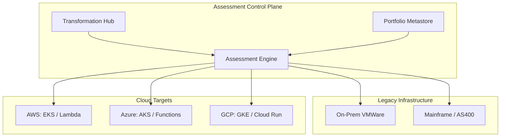
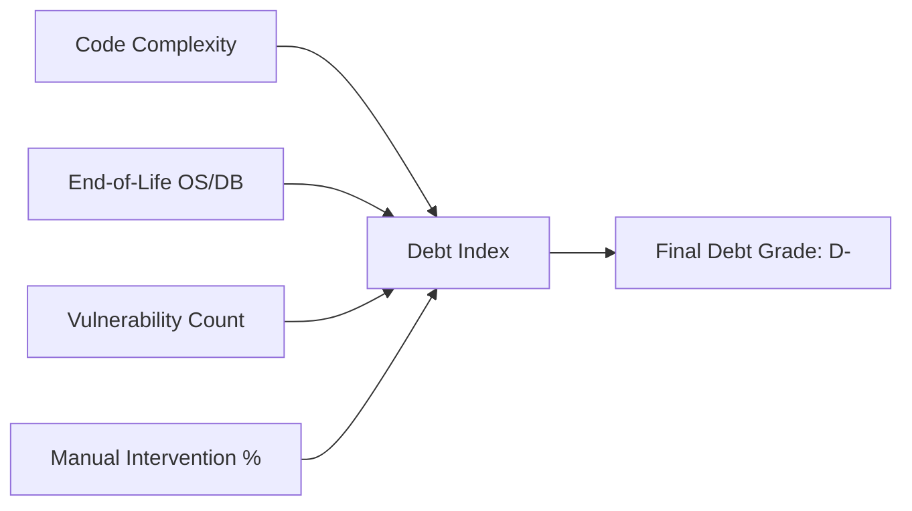
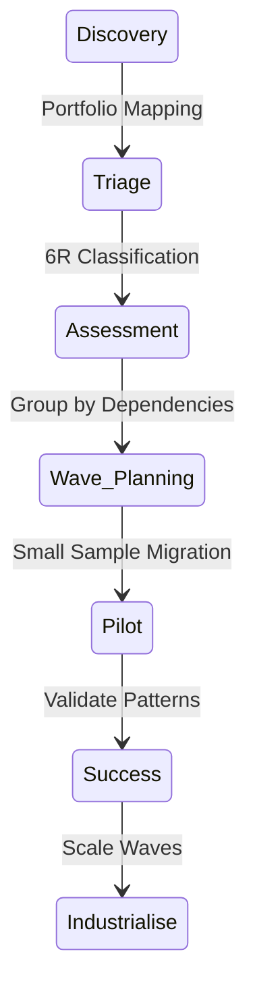

# Architecture & Assessment Diagrams

## 11. Multi-Cloud Modernization Topology (Detailed)
*How the platform orchestrates assessment across AWS, Azure, and GCP.*

## 13. "Technical Debt" scoring logic

## 20. Migration Wave Execution Pipeline

