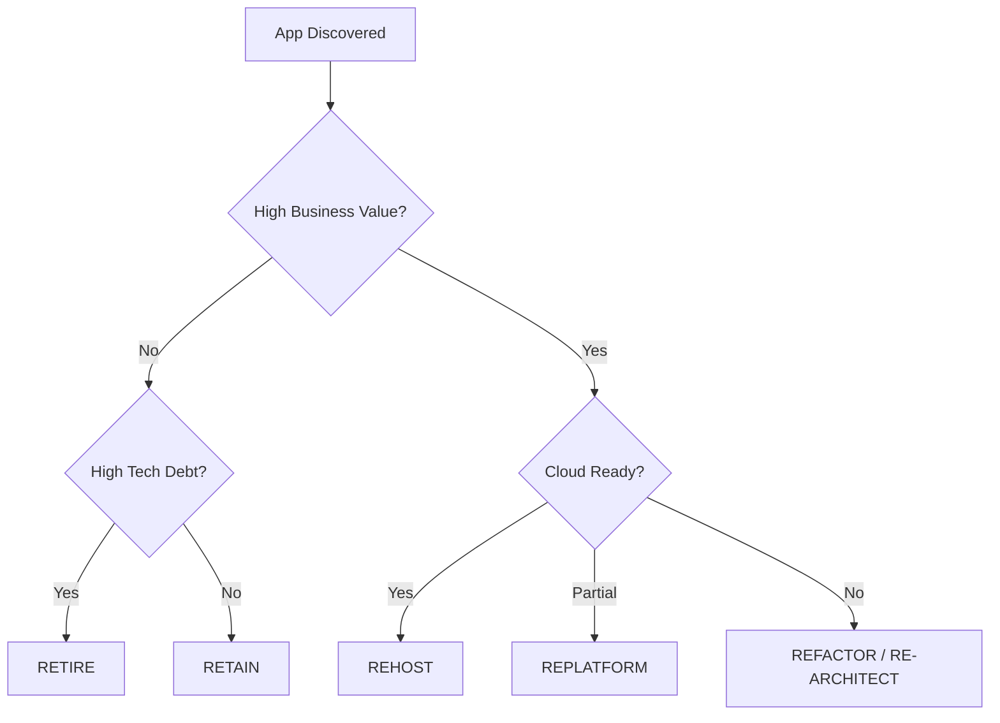
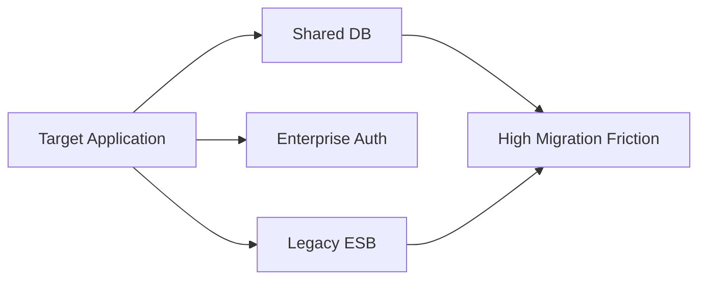
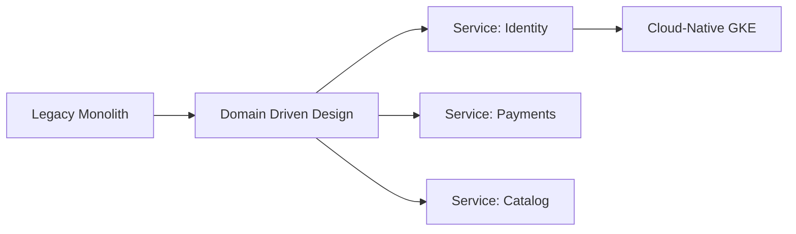

# Strategy & Roadmap Diagrams

## 31. The 7R Modernization Decision Tree

```mermaid
graph TD
    Start[App Discovered] --> Value{High Business Value?}
    Value -->|No| Debt{High Tech Debt?}
    Debt -->|Yes| Retire[RETIRE]
    Debt -->|No| Retain[RETAIN]
    Value -->|Yes| Readiness{Cloud Ready?}
    Readiness -->|Yes| Rehost[REHOST]
    Readiness -->|Partial| Replatform[REPLATFORM]
    Readiness -->|No| Refactor[REFACTOR / RE-ARCHITECT]
```

## 34. Dependency Complexity Heatmap

```mermaid
graph LR
    App[Target Application] --> D1[Shared DB]
    App --> D2[Enterprise Auth]
    App --> D3[Legacy ESB]
    D1 --> Impact[High Migration Friction]
    D3 --> Impact
```

## 40. "Decomposition" Microservices Pattern

```mermaid
graph LR
    Monolith[Legacy Monolith] --> Analysis[Domain Driven Design]
    Analysis --> S1[Service: Identity]
    Analysis --> S2[Service: Payments]
    Analysis --> S3[Service: Catalog]
    S1 --> Modern[Cloud-Native GKE]
```
